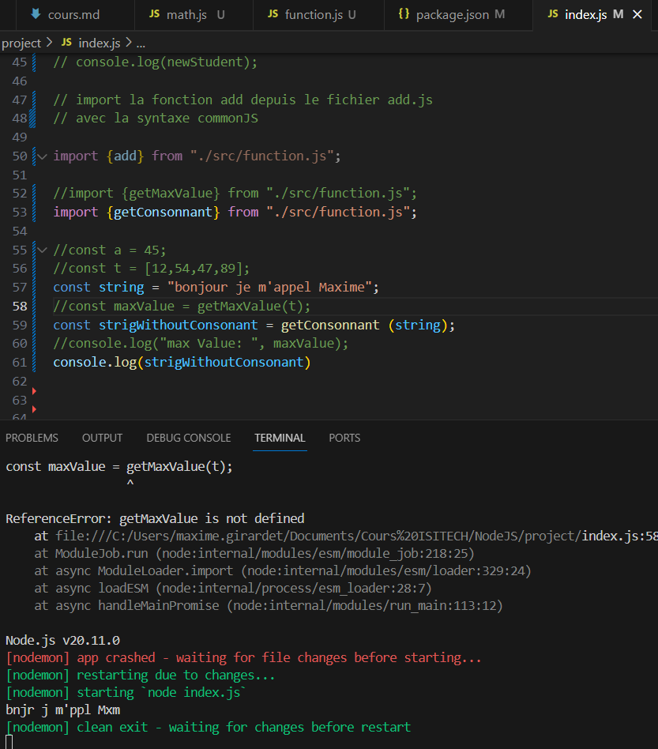

## Exercice 1 Function
Voici le code que j'ai rentré dans un fichier function.js

Voici le résultat dans mon index

## Exercice 2 

Voici le code dans l'index

et voici le code dans le fichier function.js

## Exercice 3

Voici le code de l'index 

et voici le code de function.js

## Exercice 4 
Voici le code l'index 

et voici le code du fichier function.js

## Exercice 5
Voici le Résultat 
